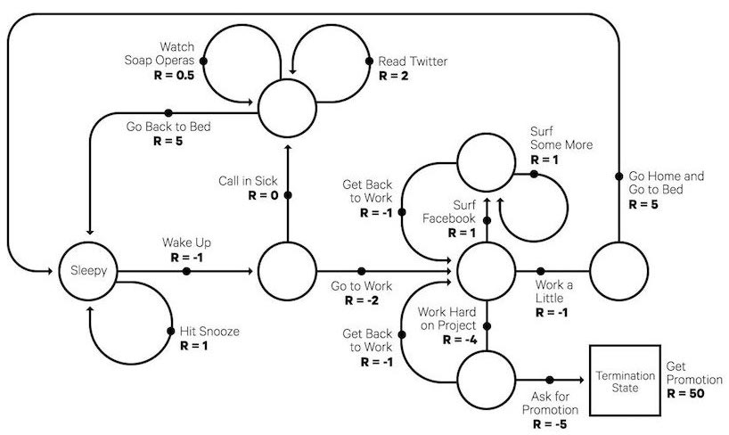
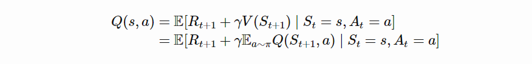
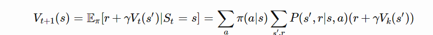
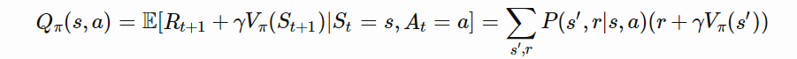
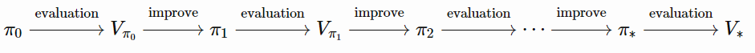

# A (Long) Peek into Reinforcement Learning

强化学习之一瞥

在这篇文章中，我们将简要的介绍(go over)下强化学习领域，从基础概念到经典算法。但愿，这篇文章是有价值的，能让初涉 RL 领域的初学者，不至于迷失在专业术语和行话(jargons)中。

近年来，人工智能(AI)领域发生了许多让人兴奋的事情(exciting news)，AlphaGo 在围棋游戏(the game of Go)中击败了人类顶级职业棋手。很快，升级版 AlphaGo Zero 在没有人类经验知识指导的前提下，以 100-0 击败了 AlphaGo。顶级职业游戏玩家在 DOTA2 1v1 竞赛中败给了 OpenAI 开发的机器人。在知道这些之后，很难不对这些算法背后的魔力-强化学习(RL)产生好奇。写这篇文章就是为了简要介绍下该领域。在这片文章中，首先会介绍一些基础的概念，然后深入讨论(dive into)解决 RL 问题的经典方法。希望这篇文章对初学者来说是一个好的起点，可以将未来的研究和前沿研究关联起来。

## What is Reinforcement Learning

假如说，在一个未知的环境中，我们有一个机器人(agent)，这个机器人通过与环境的互动可以得到一些奖励(rewards)。我们的目的是，机器人通过采取一系列的动作，使得获得的累计奖励最大。实际上，上述描述的场景可以是一个机器人玩游戏以获取高分，或者是机器人使用一些东西完成某个特定的任务；当然，不仅限于此。

Fig.1. 机器人与环境的交互，试图采取最佳的动作来最大化累计回报

强化学习的目的是通过**实验**和**反馈**给机器人学习一种好的**策略**。通过最佳的策略，机器人能够主动适应环境来最大化未来**回报**。

## Key Concepts

现在，我们来定义一些 RL 中的关键概念：环境、模型、状态、动作和奖励

机器人在*环境*中行动，环境如何对某个具体的动作做出反应是由我们可能知道或不知道的某个*模型*决定。环境可以有许多*状态*，机器人可以停留在其中任意一种状态，机器人可以采取的动作也可以有多种，机器人可以选择执行某种*动作*，让自己从一种状态切换到另一种状态。采取动作后，机器人到底会到达哪种状态，由状态之间的转移概率决定的。一旦采取了某个动作，环境会提供*奖励*作为反馈。

模型定义了奖励函数和转移概率。基于是否了解模型的详情，RL 分为了两种情况：

* 已知模型：基于已知信息的规划；基于模型的 RL。当我们完全了解所处的环境时，可以通过[动态规划](https://en.wikipedia.org/wiki/Dynamic_programming)找到最优解。是否还记得算法课上学过的“最长递增子序列”或“旅行商问题”呢？当然，这个不是本文的重点。
* 未知模型：用不完整的信息学习； 无模型 RL 或尝试学习确定性模型作为算法的一部分。以下大多数内容适用于模型未知的情况。

在最大化奖励和的目标下，策略(policy) π(s) 是为处于某种状态下的机器人采取最优动作提供了指导。每一种状态都关联了一个值函数 V(s)，值函数预测的是一个未来的期望收益，也就是，在某个状态下，基于相应策略指导后采取相应动作后，能收到的奖励和，是一种对未来的估计。换句话说，值函数是衡量一个状态的好坏。策略和值函数都是我们在强化学习中要学习的.

Fig.2. 基于我们是否要对价值，政策或环境建模的RL方法概述.图片来源[David Silver’s RL course](https://youtu.be/2pWv7GOvuf0)

随时间的推移，机器人和环境的交互包含了一系列的动作和观察到的奖励$t = 1,2, \ldots ,T$。在这个过程中，机器人学习关于所处环境的知识、学习最优策略，以及为了有效学习最优策略应该下一步要采取的动作。我们分别用 ${S_t}\\), \\({A_t}\\), and \\({R_t}$ 来表示每个时间步上的状态、动作和奖励。因此，可以用一个 episode 来完整的表述整个的交互序列，并且序列的终止状体是 $T_s$。

$${S_1},{A_1},{R_1},{S_2},{A_2}, \cdots ,{S_T}$$

深入讨论不同种类 RL 算法时候，会遇到的一些术语：

* Model-based(基于模型)：依赖于对环境的建模；模式是已知的，或者通过算法能够明确的学习的
* Model-free(无模型)：在学习的过程中，不依赖于对环境的建模
* On-policy(基于策略的)：基于目标策略，使用确定性的结果或样本来训练算法
* Off-policy(无策略的)：在转移概率分布或者由不同行为策略产生的 episodes 上训练，而不是使用目标策略产生的分布

## Model: Transition and Reward

模型是环境的描述。通过模型，我们可以学到或者推断出环境是如何与机器人进行交互和提供的反馈的。模型有两个主要主要部分，转移概率函数 P 和 奖励函数 R.

假设我们处于状态 s，我们决定采取动作 a 去达到下一个状态 s’，并且获得的奖励是 r。这个过程是一个一步转移(one transition step)，表示为一个四元组 $\left( {s,a,s',r} \right)$。

在采取动作 a 并获取奖励 r 后，转移函数 P 记录的是从一个状态 s 到另一个状态 s’ 之间的转移概率。用符号 ${\rm P}$ 表示概率。

$$P\left( {s',r|s,a} \right) = {\rm{P}}\left[ {{S_{t + 1}} = s',{R_{t + 1}} = r|{S_t} = s,{A_t} = a} \right]$$

因此，状态转移函数可以定义为 \\(P_{ss'}^a\\)
$$P_{ss'}^a = P\left( {s'|s,a} \right) = {\rm{P}}\left[ {{S_{t + 1}} = s'|{S_t} = s,{A_t} = a} \right] = \sum\nolimits_{r \in R} {P\left( {s',r|s,a} \right)} $$

奖励函数用于预测采取确定动作后的未来收益：
$$R\left( {s,a} \right) = {\rm{E}}\left[ {{R_{ + 1}}|{S_t} = s,{A_t} = a} \right] = \sum\nolimits_{r \in R} r \sum\nolimits_{s' \in S} {P\left( {s',r|s,a} \right)} $$

## Policy

策略，也可以看作机器人的行为函数 π，可以告诉我们在状态 s 下，后续应该采取哪一个动作。策略是一个从状态 s 到动作 a 的映射，策略可以是确定性的也可以是随机的：

* 确定性：$\pi \left( s \right) = a$
* 随机性：$\pi \left( {a|s} \right) = {{\rm{P}}_\pi }\left[ {A = a|S = s} \right]$

## Value Function

值函数通过预测未来的收益，来衡量状态的好坏或者一个状态或动作奖励程度。未来的收益，或者说回报，是后续奖励的加权和。从时间步 t 开始计算回报 ${G_t}$:
$$ {G_t} = {R_{t + 1}} + \gamma {R_{t + 2}} +  \cdots  = \sum\limits_{k = 0}^\infty  {{\gamma ^k}{R_{t + k + 1}}} $$

折扣系数 γ 惩罚未来获取到收益，因为：

* 未来的奖励有太大的不确定性，例如股票市场
* 未来的奖励不会立即带来收益
* 折扣系数带来数学上的便利
* 我们不必担心状态转换图中的无限循环

状态值是状态 s 的期望回报，当我们在时间 t 处于状态 s 的情况下 ${S_t} = s$:
$$V\pi \left( s \right) = {\rm{E}}\left[ {{G_t}|{S_t} = s} \right]$$

类似的，我们用状态-动作对来定义动作值：
$${Q_\pi }\left( {s,a} \right) = {\rm{E}}\left[ {{G_t}|{S_t} = s,{A_t} = a} \right]$$

另外，由于我们遵循目标策略π，因此我们可以利用可能的动作和Q值的概率分布来恢复状态值：
$${V_\pi }\left( s \right) = \sum\nolimits_{a \in A} {{Q_\pi }\left( {s,a} \right)\pi \left( {a|s} \right)} $$

动作值和状态值之间的差值是action advantage function(A-value):
$${A_\pi }\left( {s,a} \right) = {Q_\pi }\left( {s,a} \right) - {V_\pi }\left( s \right)$$

## Optimal Value and Policy

最优的值函数产生最大的回报：
$${V_ * }\left( s \right) = \mathop {\max }\limits_\pi  {V_\pi }\left( s \right),{Q_ * }\left( {s,a} \right) = \mathop {\max }\limits_\pi  {Q_\pi }\left( {s,a} \right)$$

最优的策略获得最优的值函数：
$${\pi _ * } = \mathop {\arg \max }\limits_\pi  {V_\pi }\left( s \right),{\pi _ * } = \mathop {\arg \max }\limits_\pi  {Q_\pi }\left( {s,a} \right)$$

因此，我们可以得到 ${V_{{\pi _ * }}}\left( s \right) = {V_ * }\left( s \right)\\) 和 \\({Q_{{\pi _ * }}}\left( {s,a} \right) = {Q_ * }\left( {s,a} \right)$。

## Markov Decision Processes

用更正式的术语来说，几乎所有的 RL 问题都可以用马尔可夫决策过程（MDP）来表示。
$${\rm{P = }}\left[ {{S_{t + 1}}|{S_t}} \right] = {\rm{P}}\left[ {{S_{t + 1}}|{S_1}, \ldots ,{S_t}} \right]$$

或者换句话说，未来只和当前有关，而和过去无关。

Fig.3 机器人和环境的交互是一个马尔可夫决策过程(图片来源：Sec. 3.1 Sutton & Barto (2017))

一个马尔可夫决策过程包含了五个元素 $M = \left\langle {S,A,P,R,\gamma } \right\rangle $，其中符号含义和之前提及的概念具有相同的含义

* S  - 状态的集合
* A - 动作的集合
* P - 转移概率函数
* R - 奖励函数
* γ - 未来奖励的折扣系数. 在一个未知的环境中，一般对于 P 和 R 是未知的

Fig.4. 一个有趣的例子关于马尔可夫决策过程: 典型工作的一天. (图片来源: randomant.net/reinforcement-learning-concepts)

## Bellman Equations

贝尔曼方程式是指将价值函数分解为即时奖励和折现未来价值的一组方程式。
$$
V\left( s \right) = {\rm{E}}\left[ {{G_t}|{S_t} = s} \right] = {\rm{E}}\left[ {{R_{t + 1}} + \gamma {R_{t + 2}} + {\gamma ^2}{R_{t + 3}} +  \cdots |{S_t} = s} \right] = {\rm{E}}\left[ {{R_{t + 1}} + \gamma \left( {{R_{t + 2}} + \gamma {R_{t + 3}} +  \cdots } \right)|{S_t} = s} \right] = {\rm{E}}\left[ {{R_{t + 1}} + \gamma {G_{t + 1}}|{S_t} = s} \right] = {\rm{E}}\left[ {{R_{t + 1}} + \gamma V\left( {{S_{t + 1}}} \right)|{S_t} = s} \right]
$$

类似的，对于 Q 值

## Bellman Expectation Equations

递归更新过程可以进一步分解为基于状态值和动作值函数的方程式。

Fig.5 贝尔曼期望方程如何更新状态值和动作值的图示

### Bellman Optimality Equations

如果我们只对最优值感兴趣，而不是基于策略计算期望，那么在迭代更新的过程中可以不使用策略的情况下，我们可以直接得到最大返回值的。回顾：最优值是我们可以获得的最佳回报。

不要惊讶他们和贝尔曼期望方程那么的相似。

如果我们对环境完全了解，这就变成了一个规划问题，可以通过 DP 求解。不幸的是，我们不知道环境，或者无法直接通过应用贝尔曼方程来求解 MDP 问题。但这位许多的 RL 算法奠定了理论基础。

## Common Approaches

现在来看下解决 RL 问题的主要方法和经典算法。在后续的文章中，我计划进一步探讨每种方法。

### Dynamic Programming

当模型完全未知的情况下，根据 Bellman 方程，我们可以用动态规划迭代的评估值函数并改进策略

#### Policy Evaluation

策略评估是在给定的策略 π 下计算状态-价值 ${V_\pi }$

#### Policy Improvement

基于价值函数，通过贪婪的行动来生成更好的策略 π′≥π

#### Policy Iteration

广义策略迭代（GPI）算法是一种在将策略评估与改进结合起来时用于改进策略的迭代过程。

在广义策略迭代算法中，值函数不断近似的逼近当前策略的真实值，同时迭代过程中，策略也在不断逼近最优。这个策略迭代的过程是有效的且总能收敛到最优值，但是为什么会出现这种情况呢？

我们有一个策略函数π，然后通过贪心策略选择动作后得到提升版本的策略$\pi '$，同时$\pi '\left( s \right) = \arg {\max _{a \in A}}{Q_\pi }\left( {s,a} \right)$，那么提升后的策略$\pi '$肯定是更优的，因为：

$${Q_\pi }\left( {s,\pi '\left( s \right)} \right){\rm{ = }}{Q_\pi }\left( {s,\arg {{\max }_{a \in A}}{Q_\pi }\left( {s,a} \right)} \right) = \mathop {\max }\limits_{a \in A} {Q_\pi }\left( {s,a} \right) \ge {V_\pi }\left( s \right)$$
